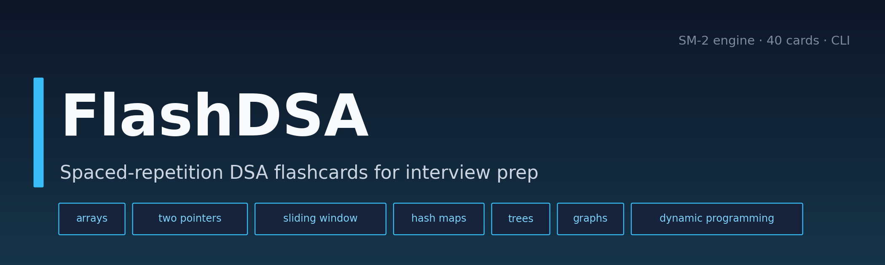
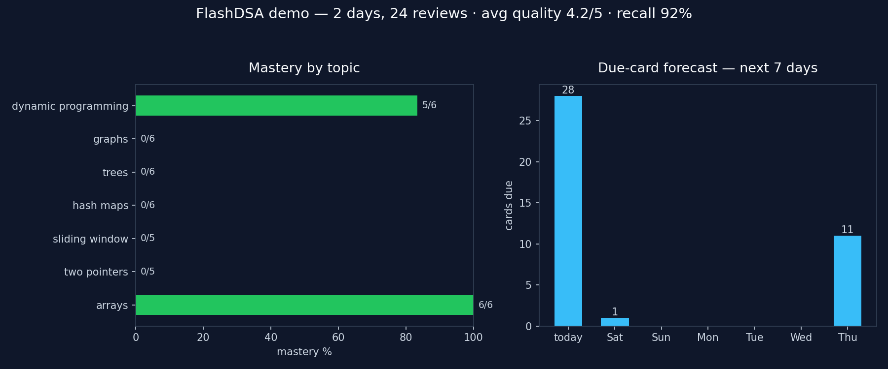

# ⚡ FlashDSA

**Stop re-reading the same solutions. Start remembering them.** FlashDSA is a spaced-repetition flashcard app for data structures & algorithms interview prep — it schedules every card with the SM-2 algorithm (the same family of algorithms behind SuperMemo and Anki), so hard cards come back soon and mastered cards get out of your way.

[](https://github.com/872000/flashdsa)
[](https://www.python.org/)
[](pyproject.toml)
[](LICENSE)

## 👀 See it in action

A two-day scripted review session, generated by the app itself (`python -m flashdsa demo`):



*Real output from the bundled demo data: after two days of reviews, arrays is fully learned (6/6), the SM-2 scheduler has pushed mastered cards a week out, and the forecast shows exactly what's due when.*

## ✨ Features

- **SM-2 from scratch** — easiness factor, intervals, repetition counts, and 0–5 self-grades, implemented by hand in `flashdsa/sm2.py` (no Anki libraries).
- **40-card DSA deck included** — arrays, two pointers, sliding window, hash maps, trees, graphs, and dynamic programming. Each card has a prompt, a full answer, a topic tag, and a difficulty rating.
- **CLI quiz sessions** — shows due cards, flips to reveal the answer, asks for a 0–5 self-grade, reschedules with SM-2, and ends with a session summary (reviews, average quality, recall rate).
- **SQLite-backed stats** — every review is logged; per-card history, per-topic mastery %, review heatmap data, and a 7-day due-card forecast via the `stats` command.
- **Zero setup** — stdlib only for the core app; chart rendering is an optional extra. No API keys, no network, no accounts.
- **46-test suite** — SM-2 math is verified against the original algorithm spec (1 → 6 → interval×EF progression, EF floor of 1.3, failure resets).

## 🛠 Tech stack

| Layer | Choice |
|---|---|
| Language | Python 3.10+ |
| Scheduling | SM-2 implemented from scratch (`flashdsa/sm2.py`) |
| Storage | SQLite via stdlib `sqlite3` — card state + full review history |
| CLI | stdlib `argparse` (`quiz`, `stats`, `init`, `demo`) |
| Charts | matplotlib (optional, demo/README screenshots only) |
| Tests | pytest, 46 tests |

## 🚀 Quickstart

```bash
# 1. Clone and enter
git clone https://github.com/872000/flashdsa.git
cd flashdsa

# 2. Watch it work end-to-end on bundled demo data (no setup needed)
python -m flashdsa demo

# 3. Start your own review session (interactive)
python -m flashdsa quiz

# 4. Check mastery by topic + what's due this week
python -m flashdsa stats

# 5. Run the test suite
python -m pytest
```

Non-interactive quiz (scripted grades, handy for scripting):

```bash
python -m flashdsa quiz --limit 5 --grades "5,4,3,5,2"
```

Your review history lives at `~/.local/share/flashdsa/flashdsa.db` (override with `--db` or the `FLASHDSA_DB` env var). The demo always uses a throwaway database — it never touches your real progress.

Self-grading guide used during quizzes: `5` perfect · `4` hesitant but correct · `3` correct with difficulty · `2` wrong, answer looked familiar · `1` wrong, barely recalled · `0` blackout.

## 🗂 Project structure

```
flashdsa/
├── flashdsa/
│   ├── sm2.py        # SM-2 spaced-repetition algorithm, from scratch
│   ├── cards.py      # Card model + bundled deck loader/validator
│   ├── db.py         # SQLite: card scheduling state + review history
│   ├── quiz.py       # Review session (interactive or scripted grades)
│   ├── stats.py      # Topic mastery, 7-day forecast, review heatmap
│   ├── demo.py       # Scripted 2-day demo on throwaway demo data
│   └── cli.py        # argparse entry point: quiz / stats / init / demo
├── data/
│   └── deck.json     # 40 bundled DSA cards (7 topics)
├── tests/            # 46 pytest tests (SM-2 spec, deck, DB, stats, quiz)
├── docs/
│   ├── hero.png      # banner
│   └── session.png   # real chart rendered by `flashdsa demo`
├── LICENSE           # MIT
└── pyproject.toml
```

## 🗺 Roadmap

- [ ] Import custom decks (CSV / Markdown)
- [ ] `review` heatmap rendered in the terminal
- [ ] FSRS scheduler as an alternative to SM-2
- [ ] Export progress report (Markdown/PDF) for interview tracking
- [ ] Optional TUI mode for quiz sessions

## 📄 License

MIT — see [LICENSE](LICENSE). Built by [Parth (872000)](https://github.com/872000).
